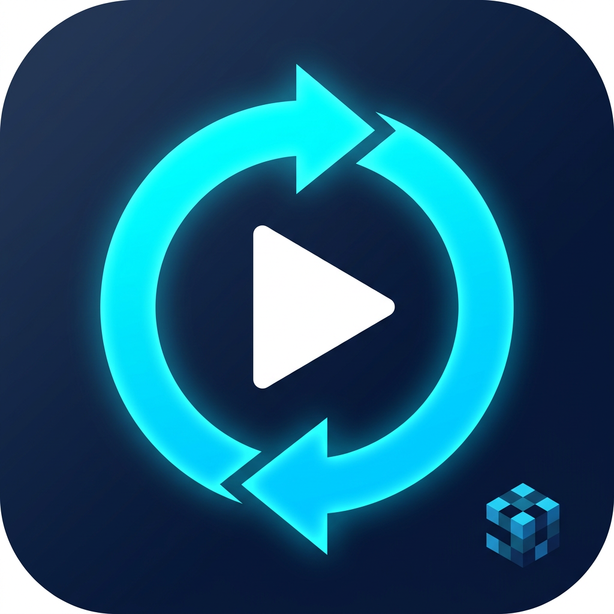

# ifuto-replay

Minecraft (Fabric / **1.21.11**) 用の **パケット保存式録画 Mod** です。

録画中は「サーバーとやりとりしたパケットをそのままファイルに書き出す」だけなので**超軽量**。
あとでそのパケットを再生しながら描画するので、**出力時に FPS・解像度・ビットレートを自由に選べます**。

> [!NOTE]
> この README は **録画コア（パケットの保存）** の説明です。
> 再生と動画書き出しは次の段階で実装します（[ロードマップ](#ロードマップ)）。

## しくみ（なぜ軽いのか）

普通の「画面録画」は 1920×1080 / 60fps で **毎秒 300MB 以上** の絵を処理します。
パケット保存式は、同じ時間に **数十KB〜数百KB** しか仕事がありません。

| | 画面録画 | ifuto-replay（パケット保存） |
| --- | --- | --- |
| 録画中の仕事 | 毎フレーム画面を読んで圧縮 | 届いたパケットを直列化してキューに積むだけ |
| 60fps を維持できるか | 重い設定だと厳しい | 描画には一切触らないので影響ほぼゼロ |
| 出力時の自由度 | 録った時点で固定 | **あとから FPS / 解像度 / ビットレートを選べる** |
| 視点 | 録った視点のみ | パケット＝世界そのものなので、カメラを自由に動かせる |

録画中に実際にやっていること（軽量化の中身）:

1. **のぞく場所は1か所だけ**
   `ClientConnection#channelRead0`（受信）と `ClientConnection#send`（送信）に Mixin を1本ずつ。
   どちらもシングルプレイ・マルチプレイ両方で必ず通るので、ここだけで全部取れます。
   PLAY フェーズ（パケットリスナーが `ClientPlayNetworkHandler`）以外は無視します。
2. **録画していないときのコストは `null` チェック1回**
   キーバインドの処理も含め、ふだんは何もしません。
3. **直列化は受け取ったスレッドで即座に**
   パケットは「あとで中身が変わる」可能性があるので後回しにできません（ReplayMod も同じ方針）。
   対応表は自作せず、バニラの `PlayStateFactories` のコーデックを借ります。バージョンが上がっても追従できます。
4. **ファイルIOと圧縮は別スレッド**
   ゲーム側は `offer()` でキューに積むだけ。**満杯なら捨てます**（絶対にゲームを待たせない）。
   捨てた数は録画終了時のログとカウンタに出ます。
5. **コピーは最小限**
   パケットの中身は Netty の `ByteBuf` のまま書き込みスレッドへ渡し、書き終わった側で `release()`。
6. **同じ種類のパケットは2回目から番号だけ**
   識別名を毎回書かない（最初の1回だけ定義フレームを書く）。
7. **維持用パケットは除外できる**
   KeepAlive / Ping などは再生に影響しないので既定で捨てます。

## つかいかた

| 操作 | 既定キー |
| --- | --- |
| 録画 開始 / 停止 | **`R`** |
| しおり（マーカー）を付ける | **`M`** |

- 録画中は画面の隅に `● 0:12  4.2 MB` のように出ます（位置・表示は設定で変更可）
- ファイルは **ゲームフォルダの `ifuto-replay/`** に `2026-09-13_01-23-45.ifreplay` という名前で保存されます
- サーバーから抜けたとき / ゲームを終了したときは、自動で保存して閉じます
- 録画中でなくても、Mod Menu の設定画面から「フォルダを開く」で保存先を開けます

ファイル形式の詳細は [`docs/replay-file-format.md`](../docs/replay-file-format.md) を参照。

## 設定（Mod Menu）

| 項目 | 説明 | 既定値 |
| --- | --- | --- |
| 自動録画 | ワールド/サーバーに入ったら自動で録り始める | オフ |
| 操作も記録 | 自分から送ったパケット（C2S）も残す | オン |
| 維持パケット除外 | KeepAlive / Ping を記録から除く | オン |
| 圧縮 | なし / 速い / 標準（書き込みスレッド側で処理） | なし |
| サイズ上限 | 超えたら自動停止して保存（0 = 無制限） | 無制限 |
| 時間上限 | 超えたら自動停止して保存（0 = 無制限） | 無制限 |
| 録画中表示 | 画面の隅に経過時間とサイズを出す | オン |
| 表示位置 | 録画中表示の隅 | 左上 |
| チャット通知 | 開始・保存・しおりをチャットに出す | オン |
| 保存先フォルダ | ゲームフォルダからの相対パス | `ifuto-replay` |

設定は `config/ifuto-replay.json` に保存されます。Mod Menu が入っていなくても、この JSON を直接編集すれば設定できます。

`config/ifuto-replay.json` には、次期実装の書き出し用の項目（`exportFps` / `exportWidth` /
`exportHeight` / `exportBitrateKbps` / `ffmpegPath`）もすでに用意してあります。

## 必要環境

- Minecraft **1.21.11**
- Fabric Loader — 1.21.11 対応の **全バージョン**（0.16.0 以上ならそのまま動作します）
- [Fabric API](https://modrinth.com/mod/fabric-api)
- （任意）[Mod Menu](https://modrinth.com/mod/modmenu) **17.x** — GUI 設定画面用

## ロードマップ

1. ✅ **録画コア**（この版）— パケットの取りこぼしなし保存・非同期書き込み・しおり・インジケータ
2. ⬜ **再生** — 保存したパケットを `EmbeddedChannel` でデコードし、リプレイ用のワールドに流し込む。
   シークは保存済みのインデックスを使う
3. ⬜ **書き出し** — パケットを時間で補間しながら、**任意の FPS / 解像度 / ビットレート** で
   オフスクリーンに描画し、ffmpeg へ rawvideo のパイプで渡して動画にする
   （設定項目はすでに `config/ifuto-replay.json` にあります）

## ライセンス

MIT
